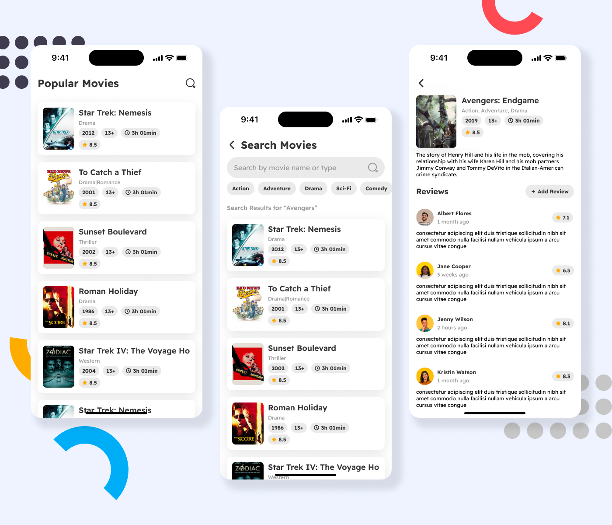

# movies_demo

> Movies demo app build with flutter using TMDB Apis.



### TODO:

1. [ ] Modify app’s ui as shown in above picture
2. [ ] Implement pagination for popular movies
3. [ ] Implement search functionality with pagination, use below api for that:

* Path: `/search/movie`
* Query Parameters:
  ```json
  {
    "page": 1,
    "query": "search_query"
  }
  ```
* Success Response:
  ```json
  {
    "page": 1,
    "results": [
      {
        "poster_path": "/pMdTc3kYCD1869UX6cdYUT8Xe49.jpg",
        "adult": false,
        "overview": "Feature-length documentary about ...",
        "release_date": "2012-09-25",
        "genre_ids": [
          99
        ],
        "id": 161097,
        "original_title": "Marvel Studios: Building a Cinematic Universe",
        "original_language": "en",
        "title": "Marvel Studios: Building a Cinematic Universe",
        "backdrop_path": "/yeKT2gNFxHGbTT3Htj5PE9IerGJ.jpg",
        "popularity": 1.136598,
        "vote_count": 4,
        "video": false,
        "vote_average": 3.88
      }
    ],
    "total_pages": 1,
    "total_results": 14
  }
  ```

4. [ ] Implement reviews feature for movies using local database [Add/Remove/List] - When user clicks on movie open
   reviews
   screen where user can see & give reviews.
